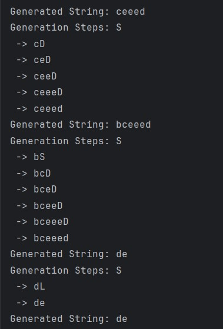

# Laboratory Work: Implementing Symbolic Grammar and State Machine

## Theory

In computational theory, a **context-free grammar (CFG)** is used to generate all possible strings in a given formal language. CFG consists of a set of production rules that describe how strings in the language can be formed from a set of non-terminal symbols (which can be replaced) and terminal symbols (which cannot be replaced).

A **finite automaton (FA)**, on the other hand, is a simple machine used to recognize patterns within input strings. It consists of states and transitions between these states; based on the input symbol, it moves from one state to another. It has a start state and one or more accept states. If it ends in an accept state after processing an input string, the string is considered accepted.

## SymbolicGrammar Class

The `SymbolicGrammar` class is an implementation of a context-free grammar. It is designed to generate strings and trace their generation based on predefined production rules and terminal symbols. 

### Attributes:
- `non_terminals`: A list of symbols that can be replaced (`['S', 'L', 'D']`).
- `terminals`: A list of symbols that cannot be replaced (`['a', 'b', 'c', 'd', 'e', 'f', 'j']`).
- `rules`: Production rules defining how non-terminals can be replaced.
- `end_symbols`: Terminal replacements for non-terminals.
- `start_symbol`: The initial symbol from which string generation begins (`'S'`).

### Example Production Rules:
```python
rules = { 
    'S': ['aS', 'bS', 'cD', 'dL'],
    'L': ['eL', 'fL', 'jD'],
    'D': ['eD'],
}
end_symbols = { 
    'S': ['e'],
    'L': ['e'],
    'D': ['d']
}
```
### Methods:
- `create_string`: Generates a string by randomly applying production rules until only terminal symbols remain.
- `trace_string_creation`: Similar to `create_string`, but also traces the steps of the generation, showing how the string evolves at each step.
- `convert_to_automaton`: Converts the grammar into a finite automaton, which can be used to validate whether a given string can be generated by the grammar.

## StateMachine Class

The `StateMachine` class is an implementation of a finite automaton. It models the automaton's states, transitions, and the process of validating input strings. The class includes:

### Attributes:
- `all_states`: A set of all states in the automaton.
- `alphabet`: A set of input symbols the automaton can process.
- `state_links`: A dictionary mapping states to their possible transitions based on input symbols.
- `initial_state`: The starting state of the automaton.
- `final_states`: A set of states in which the automaton can accept the input string.

### Methods:
- `define_initial_state`: Sets the initial state of the automaton.
- `register_state`: Adds a new state to the automaton. States can be marked as final.
- `create_link`: Defines a transition from one state to another based on an input symbol.
- `validate_string`: Takes an input string and determines whether it is accepted by the automaton, following the defined transitions from the initial state and checking if it can end in a final state.

## Interaction between Classes

The `SymbolicGrammar` and `StateMachine` classes interact primarily through the `convert_to_automaton` method of `SymbolicGrammar`. This method utilizes the structure and rules defined in the grammar to create a finite automaton with equivalent behavior, allowing for the validation of strings against the grammar.

The `convert_to_automaton` method systematically adds states and transitions to the `StateMachine` instance based on the grammar's non-terminals, terminals, and production rules. This conversion is pivotal for demonstrating the equivalence between context-free grammars and finite automata in recognizing specific languages or patterns within strings.

By integrating these two computational concepts, the implementation showcases the theoretical underpinnings of formal languages and automata theory, providing a practical toolset for generating and validating strings based on a defined grammar.
## Conclusion

The laboratory work on implementing Symbolic Grammar and State Machine offers a practical exploration into the foundational theories of computational linguistics and automata theory. By designing and developing the `SymbolicGrammar` and `StateMachine` classes, we have demonstrated the process of generating strings from a defined grammar and validating these strings against a constructed finite automaton. This hands-on approach not only reinforces the theoretical concepts but also provides a concrete application of these theories in programming.

### Key Takeaways:
- **Context-Free Grammar (CFG)**: The `SymbolicGrammar` class encapsulates the essence of CFG by defining non-terminal and terminal symbols along with production rules. This setup enables the generation of strings that adhere to the grammar specified, showcasing the power and flexibility of CFGs in describing formal languages.
- **Finite Automaton (FA)**: The `StateMachine` class illustrates the operational mechanics of FAs, including states, transitions, and the concept of acceptance states. Through this implementation, we observed how automata can be used to validate strings, making it a fundamental tool in pattern recognition and language processing.
- **Interconnection**: The conversion of a symbolic grammar into a finite automaton highlights the interplay between different computational theories. This transformation underscores the theoretical possibility of representing grammars as automata, thereby bridging the gap between generative and recognitive aspects of formal languages.

### Practical Applications:
The methodologies and implementations discussed in this laboratory work have wide-ranging applications in compiler design, natural language processing, and the development of programming languages. By understanding the underlying mechanics of CFGs and FAs, one can better appreciate the complexities involved in parsing and interpreting human languages and designing efficient compilers.


### Future Directions:
Further exploration can include extending the `SymbolicGrammar` class to support more complex grammar types, such as context-sensitive grammars, and enhancing the `StateMachine`
